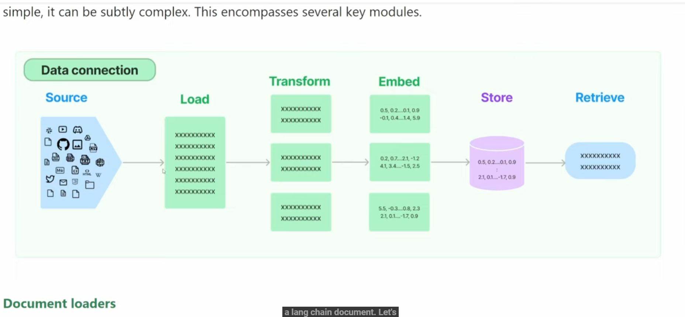

# Langchain Tutorial
Tutorial baseado na série LangChain Tutorial (Python), disponível em: https://youtu.be/ekpnVh-l3YA?si=yxcA98jQwIS3QSPu


## Conceitos
### chain
é uma sequência de chamadas que podem ser feitas a um LLM

### Agent
Usa tools (functions) para execução

### Embeddings
Mede o grau de relação entre um texto e uma query. Embeddings são usados para:
* Search: Onde resultados são ranqueados por relevância para a query
* Clustering: Onde textos são agrupados por similaridade
* Recommendations: Onde itens com relação ao texto são recomendados
* Anomaly Detection: Onde um valor atípico com pouca relação são identificados

# Fluxo (Documents, Retrieval e Vector DB)


## Document Loader

### Prompt
```
    prompt = ChatPromptTemplate.from_template("""
        Answer the user's question.
        Context: {context}
        Question: {input}
    """)
```

### Context
É usado para dar um contexto para o LLM se basear
Ex.:
```
    docA = Document(
        page_content="LangChain Expression Language, or LCEL, is a declarative way to define the structure of a document.\
              It is a language that allows you to define the structure of a document in a way that is easy to read and write. \
                LCEL is a language that is designed to be human-readable and easy to understand"
    )
```

### Input
É a pergunta do usuário
```
    res = chain.invoke({
        "context": [docA],
        "input": "What is LCEL?"
    })
```

## Vector DB
Ainda que usemos o document pra fazer scraping, via DocumentLoader, de uma site e/ou doc, teremos um problema para resolver, pois o DocumentLoader busca o dado, mas
para darmos a resposta correta é necessário determinar a relevância da informação e é aqui que entra o Vector DB.
Um Vector DB usa uma técnica chamada semantic ou similarity search. O Vector DB vai retornar apenas os documentos mais relevantes ao contexto que foi passado na query

Exemplos de Vector DB são FAISS (para rodar In memory) e o Pinecone, que é um Serverless Vector DB


### Embed
Uma função de Embedding converte os documentos do DocumentLoader em um formato apropriado que um Vector DB aceita


## Folow up conversation
O problema que tentamos resolver com o contexto conversacional é:
```
    You: Hello
    Assistent:  Hello! How can I assist you today?
    You: my name is Leo!
    Assistent:  Response: Hello Leo! How can I assist you today?
    You: what is LCEL?
    Assistent:  LCEL stands for LangChain Expression Language. It was designed to support putting prototypes in production with no code changes, from simple to complex chains. LCEL offers first-class streaming support, automatic logging to LangSmith for observability and debuggability, and seamless deployment using LangServe. It is a tool that can be used for creating and deploying chains with ease.
    You: What is my name?
    Assistent:  I'm sorry, but I cannot answer that question as I do not have access to your personal information.
```
Note que o chat não guardou o nome do usuário. Para resolver este problema, use:
```
    prompt = ChatPromptTemplate.from_messages([
        ("system", "Answer the user's questions based on the context: {context}"),
        MessagesPlaceholder(variable_name="chat_history"), # placeholder for the chat history
        ("user", "{input}")
    ])
```
